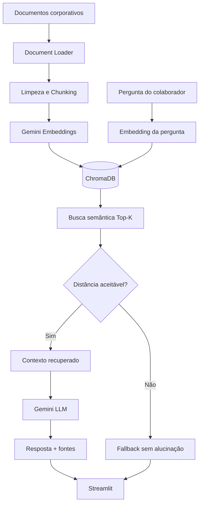

# Alura Corporate Agent

Agente corporativo de Inteligência Artificial com **RAG (Retrieval-Augmented Generation)**, desenvolvido para o **Challenge AluraAgente - ONE IA for Tech**.

O projeto simula uma base de conhecimento interna da empresa fictícia **NexaCorp**. O agente processa documentos corporativos, cria embeddings, realiza busca semântica e responde perguntas utilizando apenas informações encontradas na base indexada, exibindo as fontes utilizadas.

## Status

- Aplicação: concluída
- Pipeline RAG: concluído
- Interface Streamlit: concluída
- Container Docker: concluído
- Testes automatizados: implementados
- Validação local: pendente
- Deploy OCI: pendente
- Registro visual da execução em nuvem: pendente

> O deploy e a captura da aplicação em nuvem serão realizados após a validação local do projeto.

## Requisitos do challenge

| Requisito | Status |
| --- | --- |
| Repositório público no GitHub | Concluído |
| Agente baseado em documentos corporativos | Concluído |
| Processamento de múltiplos formatos | Concluído |
| Busca semântica e RAG | Concluído |
| Interface funcional | Concluído |
| Containerização | Concluído |
| Uso de ao menos um serviço OCI | Pendente de deploy |
| Imagem ou vídeo da execução em nuvem no README | Pendente de deploy |

## Funcionalidades

- leitura recursiva de documentos corporativos;
- suporte a PDF, Word, Excel, PowerPoint, Markdown, CSV, JSON e HTML;
- categorização automática com base na pasta de origem;
- metadados de arquivo, categoria, responsável, data e localização;
- deduplicação de conteúdo durante a ingestão;
- limpeza e normalização de texto;
- chunking com overlap;
- geração de embeddings com Gemini;
- armazenamento vetorial persistente com ChromaDB;
- busca por similaridade de cosseno;
- limiar mínimo de relevância antes da geração;
- respostas restritas ao contexto recuperado;
- fallback explícito quando a base não contém a informação;
- referências aos documentos utilizados;
- interface conversacional com Streamlit;
- reindexação manual da base pela interface;
- histórico de conversa durante a sessão;
- execução local ou via Docker.

## Arquitetura



## Fluxo do RAG

1. Os documentos da pasta `documents/` são encontrados recursivamente.
2. Cada formato é convertido para texto e recebe metadados de origem.
3. O texto é normalizado e dividido em chunks com overlap.
4. Cada chunk recebe um identificador determinístico baseado em SHA-256.
5. O Gemini gera embeddings otimizados para recuperação de documentos.
6. Os vetores e metadados são persistidos no ChromaDB.
7. A pergunta do usuário é convertida em embedding de consulta.
8. O ChromaDB retorna os chunks semanticamente mais próximos.
9. Resultados acima do limite de distância configurado são descartados.
10. O LLM recebe somente a pergunta e os trechos aprovados.
11. A interface apresenta a resposta e as fontes consultadas.

## Formatos suportados

| Formato | Extensão | Estratégia |
| --- | --- | --- |
| PDF | `.pdf` | Extração página a página com PyPDF |
| Word | `.docx` | Extração de parágrafos com python-docx |
| Excel | `.xlsx` | Conversão de linhas e colunas em texto estruturado |
| PowerPoint | `.pptx` | Extração de texto por slide |
| Markdown | `.md` | Leitura textual direta |
| CSV | `.csv` | Conversão de registros em pares chave/valor |
| JSON | `.json` | Serialização estruturada e legível |
| HTML | `.html`, `.htm` | Extração de conteúdo com BeautifulSoup |

PDFs escaneados que não possuam camada textual exigiriam OCR. Esse processamento não faz parte do MVP atual.

## Base documental fictícia

A NexaCorp possui documentos de exemplo divididos por contexto de negócio:

```text
documents/
├── comunicacao/
│   └── faq.md
├── financeiro/
│   └── politica_reembolso.csv
├── legal/
│   └── codigo_conduta.json
├── operacional/
│   └── onboarding.html
└── rh/
    └── politica_ferias.md
```

Cada documento recebe automaticamente metadados como:

```json
{
  "source": "politica_ferias.md",
  "source_path": "rh/politica_ferias.md",
  "category": "rh",
  "owner": "Recursos Humanos",
  "file_type": "md",
  "updated_at": "...",
  "location": "seção: document",
  "chunk_index": 0
}
```

## Stack

- Python 3.12
- Streamlit
- Google GenAI SDK
- Gemini
- ChromaDB
- PyPDF
- python-docx
- openpyxl
- python-pptx
- BeautifulSoup
- pytest
- Docker
- Oracle Cloud Infrastructure para o deploy

## Estrutura do projeto

```text
.
├── app.py
├── documents/
├── src/
│   ├── ai_client.py
│   ├── config.py
│   ├── document_loader.py
│   ├── indexing.py
│   ├── models.py
│   ├── rag.py
│   ├── text_processing.py
│   └── vector_store.py
├── tests/
│   ├── test_document_loader.py
│   ├── test_rag.py
│   └── test_text_processing.py
├── .dockerignore
├── .env.example
├── .gitignore
├── compose.yaml
├── Dockerfile
├── requirements-dev.txt
├── requirements.txt
└── README.md
```

## Configuração

### 1. Clone o repositório

```bash
git clone https://github.com/PxS00/alura-corporate-agent.git
cd alura-corporate-agent
git switch feature/mvp-rag-agent
```

### 2. Crie o ambiente virtual

```bash
python3.12 -m venv .venv
source .venv/bin/activate
```

### 3. Instale as dependências

```bash
pip install --upgrade pip
pip install -r requirements-dev.txt
```

### 4. Configure as variáveis de ambiente

```bash
cp .env.example .env
```

Edite `.env` e informe sua chave:

```env
GEMINI_API_KEY=your_api_key_here
```

Nunca versionar o arquivo `.env` ou chaves reais de API.

## Variáveis disponíveis

| Variável | Padrão | Finalidade |
| --- | --- | --- |
| `GEMINI_API_KEY` | sem valor | Credencial da API Gemini |
| `LLM_MODEL` | `gemini-3.5-flash` | Modelo de geração |
| `EMBEDDING_MODEL` | `gemini-embedding-001` | Modelo de embeddings |
| `EMBEDDING_DIMENSIONS` | `768` | Dimensão dos vetores |
| `CHROMA_PATH` | `.chroma` | Persistência local do índice |
| `CHROMA_COLLECTION` | `corporate_documents` | Nome da collection |
| `DOCUMENTS_PATH` | `documents` | Diretório da base documental |
| `CHUNK_SIZE` | `1000` | Tamanho máximo aproximado do chunk |
| `CHUNK_OVERLAP` | `150` | Sobreposição entre chunks |
| `TOP_K` | `4` | Quantidade máxima de resultados recuperados |
| `MAX_COSINE_DISTANCE` | `0.65` | Distância máxima aceita na recuperação |

## Executando localmente

```bash
streamlit run app.py
```

Acesse:

```text
http://localhost:8501
```

Na primeira execução, a aplicação cria os embeddings da base automaticamente e persiste o índice em `.chroma/`.

## Executando com Docker Compose

```bash
docker compose up --build -d
```

Verifique o container:

```bash
docker compose ps
```

Acompanhe os logs:

```bash
docker compose logs -f agent
```

Finalize:

```bash
docker compose down
```

O índice vetorial é mantido no volume nomeado `chroma-data`.

## Testes

```bash
pytest -q
```

Com cobertura:

```bash
pytest --cov=src --cov-report=term-missing
```

Os testes atuais cobrem:

- normalização de texto;
- chunking;
- estabilidade de identificadores;
- metadados de origem;
- ingestão de formatos textuais estruturados;
- deduplicação;
- resposta RAG com contexto relevante;
- fallback quando não existe evidência suficiente.

## Exemplos de perguntas

```text
Quantos dias de férias eu tenho?
```

```text
Com quanto tempo de antecedência devo pedir férias?
```

```text
Qual é o limite de reembolso para alimentação?
```

```text
Quais treinamentos são obrigatórios no onboarding?
```

```text
Como funciona o benefício para cursos e certificações?
```

Uma pergunta sem resposta na base, como:

```text
Qual é o valor do auxílio estacionamento?
```

deve resultar no fallback explícito, sem fabricação de informação.

## Segurança e confiabilidade

O MVP aplica controles simples para reduzir alucinações e exposição indevida:

- chave de API somente por variável de ambiente;
- `.env` ignorado pelo Git;
- limite de tamanho para perguntas;
- recuperação restrita à base indexada;
- limiar de relevância antes de chamar o LLM;
- prompt instruindo o modelo a utilizar somente o contexto;
- instrução explícita contra tentativas de sobrescrever as regras por prompt injection;
- fallback quando não existe evidência suficiente;
- rastreabilidade por documento e localização.

Para um ambiente corporativo real ainda seriam necessários autenticação, autorização, governança de dados, gestão centralizada de segredos, auditoria e controles adicionais de segurança.

## Deploy na Oracle Cloud Infrastructure

A etapa de deploy será executada após os testes locais.

O MVP foi preparado para utilizar uma **OCI Compute Instance** como serviço obrigatório do ecossistema Oracle Cloud.

Fluxo previsto:

```text
GitHub
  ↓
OCI Compute
  ↓
Docker
  ↓
Streamlit + RAG
  ↓
IP público / endpoint da aplicação
```

Na VM OCI, o fluxo esperado será semelhante a:

```bash
git clone https://github.com/PxS00/alura-corporate-agent.git
cd alura-corporate-agent
cp .env.example .env
# configurar GEMINI_API_KEY

docker compose up --build -d
```

Depois será necessário liberar a porta da aplicação de forma controlada na configuração de rede da OCI.

## Demonstração em nuvem

A imagem ou vídeo exigido pelo challenge será adicionado nesta seção depois do deploy na OCI.

## Limitações do MVP

- não executa OCR local para PDFs escaneados;
- não sincroniza automaticamente Google Drive, SharePoint ou OneDrive;
- não possui autenticação de colaboradores;
- reindexa a base integralmente em vez de fazer atualização incremental;
- não possui reranker dedicado;
- não possui observabilidade centralizada;
- utiliza uma base documental fictícia e pequena.

Essas limitações são intencionais para manter o challenge simples, funcional e entregável.

## Próximos passos

1. executar os testes localmente;
2. validar perguntas conhecidas e perguntas sem resposta;
3. validar execução via Docker;
4. realizar deploy na OCI Compute;
5. registrar a aplicação rodando em nuvem;
6. adicionar a evidência visual ao README;
7. finalizar a entrega do challenge.

## Autor

Desenvolvido por Lucas Rossoni para o Challenge AluraAgente - ONE IA for Tech.
